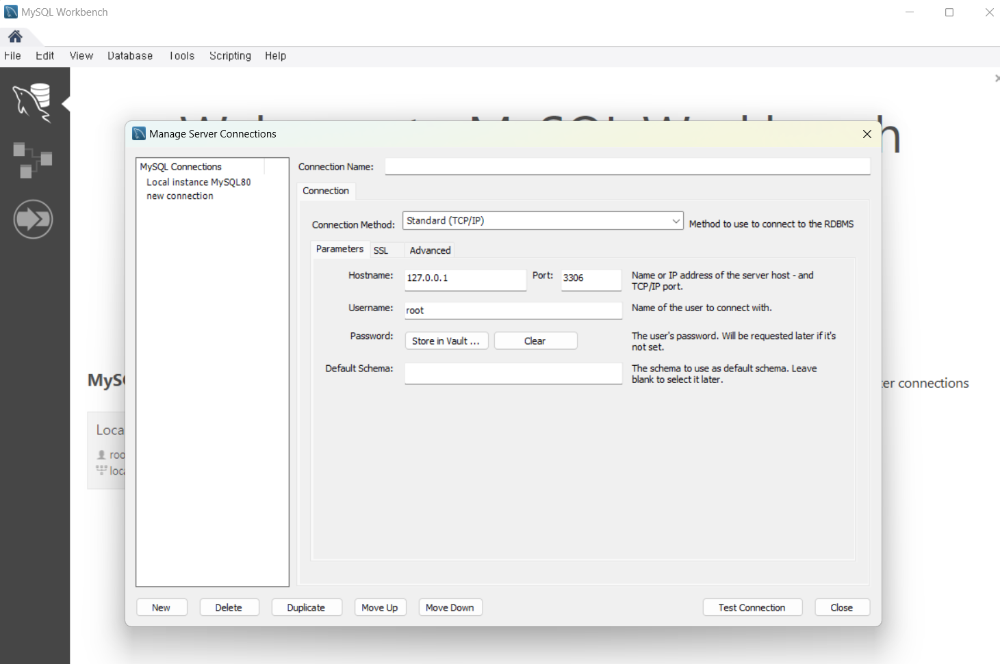

# 2024.10.01 IT 수업 정리

[MySQL_Select](https://sesoc.tistory.com/335)



- Data base manage connection - new
- 


- edit - preferences


```sql
use world;

select database(), user();

show tables;
select * from city; 

-- 1. 전세계 도시 수 : 4079개 
DESC CITY;
SELECT * FROM CITY LIMIT 3;
SELECT COUNT(*) FROM CITY;

-- 2. 전세계 국가 수 : 232개
SELECT CountryCode FROM CITY LIMIT 5;
SELECT COUNT(DISTINCT CountryCode) from CITY;

-- 3. 한국에 도시 갯수 : 70개 
desc city;
SELECT COUNT(*) FROM CITY
WHERE CountryCode lIKE '%KOR%';

-- 4. 지역명이 C로 시작하는 도시 수?
select name, District from city
where District like 'c%'
and countrycode like '%kor%';
```


```sql
-- 5. 한국의 지역명에서 2번째 글자가 'y'인 경우 도시 명은 어떤 도시가 있나요?
select name, District from city
where District like '_y%'
and countrycode like '%kor%';

-- 6. 전세계에서 도시의 인구가 300만명을 넘는 도시는 몇개인지? 46개
-- select name, District, population from city
select count(*) from city
where population > 3000000;

-- 7. 한국에서 인구가 70~100만명 사이의 도시는 어디인지?
select name, population from city
where population between 700000 and 1000000 
and countrycode like '%kor%';

-- 8. 
select name, population, CountryCode from city
where population > 500000 
and name like '___j%' or '___w';

```


[[MySql] 조회 결과 레코드 번호 매기기](https://velog.io/@jonghne/MySql-조회-결과-레코드-번호-매기기)

```sql
-- 9. 인구가 가장 많은 도시  5곳 출력
select name, population from city 
order by population desc limit 5;

-- 10.
select Countrycode, language, IsOfficial, percentage from countrylanguage
where percentage < 5 and IsOfficial = 'T'
order by percentage desc limit 10;

-- 11-1. 지역명을 기준으로 오름차순, 인구 수를 기준으로 내림차순 출력
select row_number() over (order by district asc, population desc) as number,
  name, district, population
  from city
where countrycode like '%kor%';

-- 11-2.
-- select row_number() over (order by district asc, population desc) as number,
--   name, district, population
--   from city
-- where countrycode like 'kor' limit 22,10;

select row_number() over (order by district asc, population desc) as number,
  name, district, population
  from city
where countrycode like 'kor' limit 10 offset 22;
```

- oracle decode 구문 [어제자 과제]

```sql
SELECT FIRST_NAME, DEPARTMENT_ID, SALARY,
			decode(DEPARTMENT_ID, 30, SALARY*1.1, 50, SALARY*1.1, SALARY) AS 인상된PAY,
			decode(DEPARTMENT_ID, 30, '10%+', 50, '10%+', '--') AS 인상여부,
	FROM EMPLOYEES;
```

- decode 구문은 oracle에만 있고 1대1 비교만 가능하다
    - 1대1의 = 만 비교
    - decode(data, 비교값, T, F, T, F, ….., T, F, TF 아닌 것도)
- case when 구문은 그외 다른 비교 가능


```sql
-- Q1. 단일행 함수 - 일본의 도시를 한국의 도시로 변경하여 출력
select CONCAT('KOREA:',name) as 'R.O.K'
from city
where countrycode like 'jpn';

--
create table t_city
select concat(Countrycode, name, ' ', population) as city_info
from city
order by CountryCode desc, Population desc
limit 30 
```


```sql
-- 1. 데이터베이스 생성

create database if not exists myDB:
use myDB;
select database(), user();

-- 2. 테이블 생성
drop table m_emp;
create table m_emp(
					id int primary key,
                    name char(20) not null,
                    age tinyint,
                    p_number varchar(20) default '사줘요~');

-- 3. DML - insert
desc m_emp;
# insert into m_emp(....) values(...)
-- insert into m_emp values(10, '고명근', 35, default);
-- select * from m_emp;
```

```sql
-- 1. 데이터베이스 생성

create database if not exists myDB:
use myDB;
select database(), user();

-- 2. 테이블 생성
drop table m_emp;
create table m_emp(
					id int primary key,
                    name char(20) not null,
                    age tinyint,
                    p_number varchar(20) default '사줘요~');

-- 3. DML - insert
desc m_emp;
# insert into m_emp(....) values(...)
insert into m_emp values(1, '고명근', 35, default);
insert into m_emp values(2, '고명근', 35, default);
insert into m_emp values(3, '권형록', NULL, default);
insert into m_emp values(4, '김현(나라현)', 27, '4517-1258');
insert into m_emp values(5, '박경남', 30, '1258-8547');
select * from m_emp;

-- UPDATE 
update m_emp
set name = '권혜연'
where id = 2;

select @@autocommit;
rollback;
```


```sql
# Q. 성명과 연령대를 출력하시오. (예 : 정재완, 20대)
select name,
	CASE WHEN age < 20 THEN '10대'
            WHEN age BETWEEN 20 AND 29 THEN '20대'
            WHEN age BETWEEN 30 AND 39 THEN '30대'
            WHEN age BETWEEN 40 AND 49 THEN '40대'
            WHEN age BETWEEN 50 AND 59 THEN '50대'
            WHEN age >= 60 THEN '60대 이상'
			when age is null then '정보 없음'
            END AS 연령대
from m_emp;
```


```sql
create database if not exists myDB;
use myDB;
select database(), user();

create table box_table(
					seq_no INT PRIMARY KEY,
                    years SMALLINT,
                    ranks INT,
                    movie_name VARCHAR(200),
                    release_date DATETIME,
                    sale_amt DOUBLE,
                    share_rate DOUBLE,
                    audience_num int,
                    screen_num smallint,
                    showing_count int,
                    rep_country varchar(50),
                    countries varchar(100),
                    distributor varchar(300),
                    movie_type varchar(100),
                    genre varchar(100),
                    director varchar(1000)
					);
```

