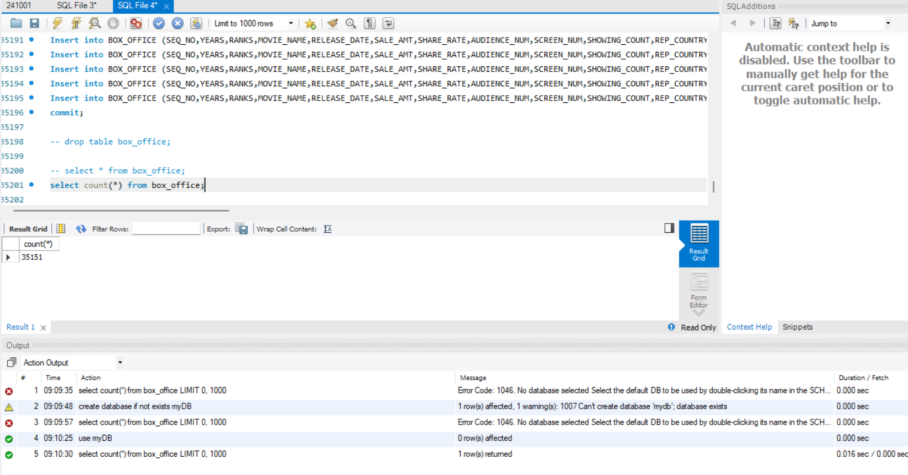

# 2024.10.02 IT 수업 정리



- 어제 등록한 box_office table

- 다시 켜려면 use mydb 하고 해야함

  


```sql
select years, 
	count(years) as '년도별 개봉 영화 수', 
    count(case when quarter(release_date) in (1,2) then 1 end)
    as '상반기 개봉 영화 수',
    count(case when quarter(release_date) in (3,4) then 1 end)
    as '하반기 개봉 영화 수'
from box_office
group by years with rollup
order by years asc;
```


[[MYSQL] 📚 WITH ROLLUP & Grouping 함수](https://inpa.tistory.com/entry/MYSQL-📚-WITH-ROLLUP)

- with rollup으로 첫행에 합계 표시
- 

```sql
-- 2번
select years, 
	count(years) as '년도별 개봉 영화 수', 
	count(case dayofweek(release_date) when 1 then 1 end) as "일-개봉",
    count(case dayofweek(release_date) when 2 then 1 end) as "월-개봉",
    count(case dayofweek(release_date) when 3 then 1 end) as "화-개봉",
    count(case dayofweek(release_date) when 4 then 1 end) as "수-개봉",
    count(case dayofweek(release_date) when 5 then 1 end) as "목-개봉",
    count(case dayofweek(release_date) when 6 then 1 end) as "금-개봉",
    count(case dayofweek(release_date) when 7 then 1 end) as "토-개봉"
from box_office
group by years with rollup
order by years asc;
```


```sql
-- 4-1번
select years, 
	count(years) as '년도별 개봉 영화 수', 
    count(case when quarter(release_date) in (1,2) then 1 end)
    as '상반기 개봉 영화 수',
    count(case when quarter(release_date) in (3,4) then 1 end)
    as '하반기 개봉 영화 수'
from box_office
where years between 2004 and 2013
group by years with rollup
order by years asc;

-- 4-2번
select years, 
	count(years) as '년도별 개봉 영화 수', 
	count(case dayofweek(release_date) when 1 then 1 end) as "일-개봉",
    count(case dayofweek(release_date) when 2 then 1 end) as "월-개봉",
    count(case dayofweek(release_date) when 3 then 1 end) as "화-개봉",
    count(case dayofweek(release_date) when 4 then 1 end) as "수-개봉",
    count(case dayofweek(release_date) when 5 then 1 end) as "목-개봉",
    count(case dayofweek(release_date) when 6 then 1 end) as "금-개봉",
    count(case dayofweek(release_date) when 7 then 1 end) as "토-개봉"
from box_office
where years between 2004 and 2013
group by years with rollup
order by years asc;

```

- 근데 컬럼에 years 뿐만  아니라 null 값도 많은 release_date 컬럼이 있어서 years로 기준으로 세면 숫자가 맞지 않음

- count를 하면 0도세고 1도셈
- sum을 넣으면 1도 셈

```sql
-- 4-1번
select year(release_date), 
	count(year(release_date)) as '년도별 개봉 영화 수', 
    count(case when quarter(release_date) in (1,2) then 1 end)
    as '상반기 개봉 영화 수',
    count(case when quarter(release_date) in (3,4) then 1 end)
    as '하반기 개봉 영화 수'
from box_office
where year(release_date) between 2004 and 2013
group by year(release_date) with rollup
order by year(release_date) asc;

-- 4-2번
select year(release_date), 
	count(year(release_date)) as '년도별 개봉 영화 수', 
	count(case dayofweek(release_date) when 1 then 1 end) as "일-개봉",
    count(case dayofweek(release_date) when 2 then 1 end) as "월-개봉",
    count(case dayofweek(release_date) when 3 then 1 end) as "화-개봉",
    count(case dayofweek(release_date) when 4 then 1 end) as "수-개봉",
    count(case dayofweek(release_date) when 5 then 1 end) as "목-개봉",
    count(case dayofweek(release_date) when 6 then 1 end) as "금-개봉",
    count(case dayofweek(release_date) when 7 then 1 end) as "토-개봉"
from box_office
where year(release_date) between 2004 and 2013
group by year(release_date) with rollup
order by year(release_date) asc;
```


```sql
SELECT distributor as '배급사',
       COUNT(*) AS '총 개봉수 - 2016',
       CONCAT(format(FLOOR(SUM(sale_amt) / 100000000),0), '억') AS '총 매출 - 2016'
FROM box_office
WHERE YEAR(release_date) = 2016 and sale_amt > 200000000
GROUP BY distributor
HAVING SUM(sale_amt) BETWEEN 10000000000 AND 150000000000
ORDER BY SUM(sale_amt) DESC;
```


- 분기별로 구분하라고 했으므로.

```sql
SELECT distributor as '배급사',
       COUNT(*) AS '총 개봉수 - 2016',
       CONCAT(format(FLOOR(SUM(sale_amt) / 100000000),0), '억') AS '총 매출 - 2016',
        count(case when quarter(release_date) = 1 then 1 end) as 'Q1',
		count(case when quarter(release_date) = 2 then 1 end) as 'Q2',
        count(case when quarter(release_date) = 3 then 1 end) as 'Q3',
        count(case when quarter(release_date) = 4 then 1 end) as 'Q4'
FROM box_office
WHERE YEAR(release_date) = 2016 and sale_amt > 200000000
GROUP BY distributor
HAVING SUM(sale_amt) BETWEEN 10000000000 AND 150000000000
ORDER BY SUM(sale_amt) DESC;
```


```sql
-- 참고
use world;
desc country;

select count(*),
	count(IndepYear),
    count(*) - count(IndepYear),
    sum(if(IndepYear is null, 1, 0))
from country;
```

[Join과 Set 연산](https://sesoc.tistory.com/342)


- JOIN

```sql
select count(*) from city; -- 4079
select count(*) from country; -- 239
select count(*) from city, country; -- 974881
select 4079 * 239; -- 974881
```


```sql
SELECT Code as 국가코드,
	COUNTRY.NAME as 국가명,
    CITY.District as 지역명,
    CITY.NAME as 도시명,
	CITY.Population as 인구
FROM COUNTRY
JOIN CITY ON COUNTRY.Code = CITY.CountryCode
```

```sql
SELECT Code as 국가코드,
	COUNTRY.NAME as 국가명,
    CITY.District as 지역명,
    CITY.NAME as 도시명,
	CITY.Population as 인구
FROM COUNTRY
JOIN CITY ON COUNTRY.Code = CITY.CountryCode;

SELECT COUNTRY.Name AS 국가명,
	COUNTRYLANGUAGE.Language AS 사용언어,
    COUNTRYLANGUAGE.IsOfficial as 공식언어유무,
    COUNTRYLANGUAGE.Percentage as 사용비율
FROM COUNTRYLANGUAGE
JOIN COUNTRY ON COUNTRY.Code = COUNTRYLANGUAGE.CountryCode;
```


- 3번

```sql
SELECT COUNTRY.NAME as 국가명, count(*) as 도시수
FROM CITY
JOIN COUNTRY ON COUNTRY.Code = CITY.CountryCode
GROUP BY COUNTRY.NAME
HAVING 도시수 BETWEEN 60 AND 150
ORDER BY 도시수 DESC;
```

- 4번  (ChatGPT의 도움)

```sql
SELECT 
    국가명, 
    SUM(도시수) AS 도시수
FROM (
    SELECT 
        COUNTRY.NAME AS 국가명, 
        COUNT(*) AS 도시수
    FROM CITY
    JOIN COUNTRY ON COUNTRY.Code = CITY.CountryCode
    GROUP BY COUNTRY.NAME
    HAVING 도시수 BETWEEN 60 AND 150
) AS 필터링된도시
GROUP BY 국가명 WITH ROLLUP
ORDER BY 도시수 DESC;

```

- **MySQL에서 서브쿼리를 사용하려면 alias를 줘야 사용가능하다.**

```sql
select ctry.name, ct.name
from country ctry, city ct
where ctry.code = ct.countrycode;
```

- 이런식으로 테이블명 간소화 가능