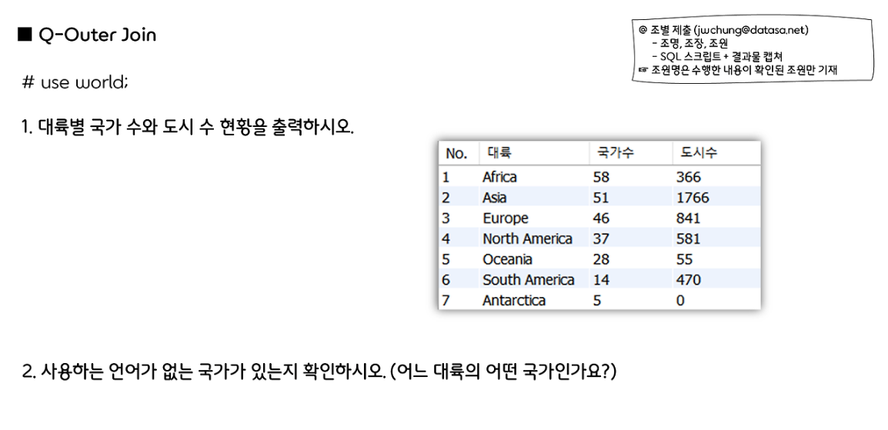

# 241008 Q-Outer Join



1. 대륙별 국가 수와 도시 수 현황을 출력하시오.

```sql
select
	rank() over(order by count(distinct con.Code) desc) as 'No.',
	con.continent as '대륙',
    count(distinct con.code) as '나라수',
    count(c.name) as '도시수'
from country as con
left join city as c on con.code = c.countrycode
group by con.continent;
```

1. 사용하는 언어가 없는 국가가 있는지 확인하시오. (어느 대륙의 어떤 국가인가요?) 

```sql
select * from country;
select * from countrylanguage;

select 
	-- c.Code,
    c.Name as "국가명",
    c.Continent as "대륙",
    l.Language as "언어",
from country c
left join countrylanguage l on c.code = l.CountryCode
where l.language is Null;

-- 사용하는 언어가 없는 국가 6개 
```