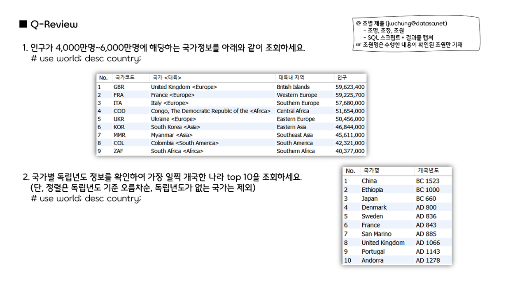

# MySQL



```sql
-- Q-Review 1번
use world;
desc country;

SELECT 
	row_number() over(ORDER BY Population DESC) AS "No.", 
	Code AS "국가코드",
	concat(Name, ' <', Continent, '>') AS "국가<대륙>", 
	Region AS "대륙내 지역",
	format(population, 0) AS "인구"
FROM Country
WHERE Population BETWEEN 40000000 AND 60000000;

-- Q-Review 2번 
SELECT 
	row_number() over(ORDER BY IndepYear ASC) AS "No.", 
	Name AS "국가명",
    CASE 
		WHEN IndepYear < 0 THEN concat("BC ", ABS(IndepYear))
        WHEN IndepYear > 0 THEN concat("AD ", IndepYear)
    END AS "개국년도"
FROM Country
WHERE IndepYear IS NOT NULL LIMIT 10;
```


```sql
-- Q-Review 3번
use myDB;
desc box_office;

SELECT 
	row_number() over(ORDER BY sale_amt DESC) AS "No.",
	year(release_date) AS "년도",
    movie_name AS "영화 제목",
    date_format(release_date, '%x-%b-%d') AS "개봉일",
    concat(format(audience_num, 0), '명') as "관객수",
    concat(ROUND(sale_amt / 100000000), '억') as "총매출"
FROM Box_Office
WHERE year(release_date) = 2019 AND
(audience_num BETWEEN 3000000 AND 7000000
OR sale_amt BETWEEN 18000000000 AND 50000000000);

-- Q-Review 4번
SELECT * FROM Box_Office
WHERE years = 2014 AND
year(release_date) BETWEEN 2018 AND 2019;
```


```sql
-- Q-Review 5번
SELECT 
	DISTINCT Movie_name AS "영화", 
	date_format(release_date,'%x%m') AS "개봉년월",
	replace(Director,',','/') AS "감독그룹" 
FROM Box_office
WHERE release_date BETWEEN '2017-11-01' AND '2017-11-30'
    AND Director LIKE "%,%"
    AND Movie_name like "%:%";

-- Q-Review 6번
SELECT 
	years AS "제작년도",
    Movie_name AS "영화명",
    rep_country AS "배포국가",
    date_format(release_date,'%x%m') AS "개봉년월",
    format(audience_num, 0) AS "관객수",
    concat(floor(round(sale_amt,-8) / 100000000),'억원') AS "매출"
FROM Box_office
WHERE year(release_date) IN (2018, 2019)
    AND Countries IN ('한국','미국')
    AND Audience_num > 10000000
ORDER BY sale_amt DESC;
```