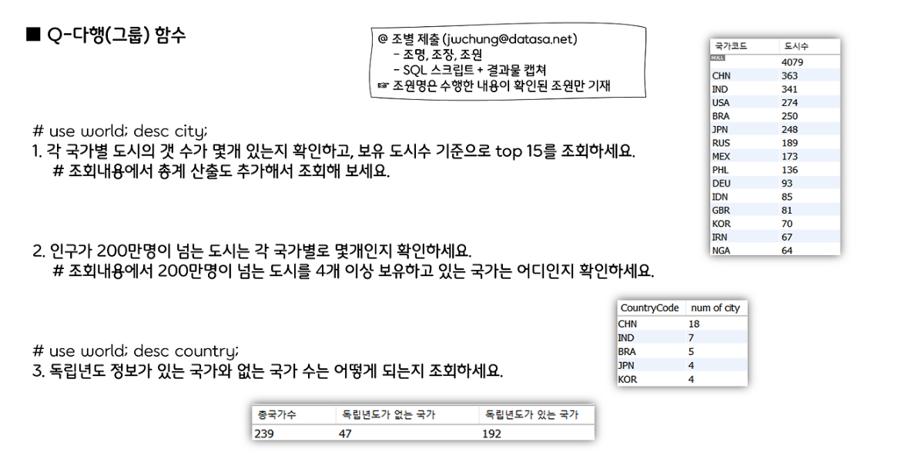

# MySQL 다행함수



```sql
-- 다행함수 1번
use world;
desc country;

SELECT
	Countrycode AS "국가코드", 
	count(*) AS "도시수"
FROM City
GROUP BY CountryCode WITH ROLLUP
ORDER BY 도시수 DESC LIMIT 15;

-- 다행함수 2번
SELECT
    CountryCode,
    count(*) AS "num of city"
FROM City
WHERE Population/pow(10,6) >= 2
GROUP BY CountryCode
HAVING count(*) >= 4
ORDER BY 2 DESC;

-- 다행함수 3번
SELECT
    count(*) AS "총국가수",
    sum(CASE WHEN indepyear IS NULL THEN 1 ELSE 0 END) AS "독립년도가 없는 국가",
    sum(CASE WHEN indepyear IS NOT NULL THEN 1 ELSE 0 END) AS "독립년도가 있는 국가"
FROM Country;
```


```sql
-- 다행함수 4-1번
select year(release_date), 
	count(year(release_date)) as '년도별 개봉 영화 수', 
    count(case when quarter(release_date) in (1,2) then 1 end)
    as '상반기 개봉 영화 수',
    count(case when quarter(release_date) in (3,4) then 1 end)
    as '하반기 개봉 영화 수'
from box_office
where year(release_date) between 2004 and 2013
group by year(release_date) with rollup
order by year(release_date) asc;

-- 다행함수 4-2번
select year(release_date), 
	count(year(release_date)) as '년도별 개봉 영화 수', 
	count(case dayofweek(release_date) when 1 then 1 end) as "일-개봉",
    count(case dayofweek(release_date) when 2 then 1 end) as "월-개봉",
    count(case dayofweek(release_date) when 3 then 1 end) as "화-개봉",
    count(case dayofweek(release_date) when 4 then 1 end) as "수-개봉",
    count(case dayofweek(release_date) when 5 then 1 end) as "목-개봉",
    count(case dayofweek(release_date) when 6 then 1 end) as "금-개봉",
    count(case dayofweek(release_date) when 7 then 1 end) as "토-개봉"
from box_office
where year(release_date) between 2004 and 2013
group by year(release_date) with rollup
order by year(release_date) asc;
```


```sql
-- 다행함수 5번 

SELECT distributor as '배급사',
       COUNT(*) AS '총 개봉수 - 2016',
       CONCAT(format(FLOOR(SUM(sale_amt) / 100000000),0), '억') AS '총 매출 - 2016',
        count(case when quarter(release_date) = 1 then 1 end) as 'Q1',
				count(case when quarter(release_date) = 2 then 1 end) as 'Q2',
        count(case when quarter(release_date) = 3 then 1 end) as 'Q3',
        count(case when quarter(release_date) = 4 then 1 end) as 'Q4'
FROM box_office
WHERE YEAR(release_date) = 2016 and sale_amt > 200000000
GROUP BY distributor
HAVING SUM(sale_amt) BETWEEN 10000000000 AND 150000000000
ORDER BY SUM(sale_amt) DESC;
```


```sql
-- 다행함수 6번
SELECT 
    if(grouping(movie_type), '총계', movie_type) AS "영화유형",
    concat(format(sum(sale_amt)/100000000,0), '억') AS '매출'		
FROM Box_office
GROUP BY movie_type WITH ROLLUP
ORDER BY sum(sale_amt)/100000000 DESC;

-- 다행함수 7번
use world;
desc country;

SELECT 
	continent AS "대륙", 
    sum(SurfaceArea) AS "면적", 
    sum(Population) AS "인구 수",
    count(code) AS "국가 수"
FROM country
GROUP BY continent;

-- 7-1. 가장 큰 면적 대륙 : Asia
-- 7-2. 가장 인구 많은 대륙 : Asia
-- 7-3. 가장 국가 많은 대륙 : Africa 
-- 7-4. 가장 인구 적은 대륙 : Antarctica
```


```sql
-- 다행함수 8번
use myDB;
desc box_office;

SELECT * FROM box_office;

SELECT
	year(release_date) AS "년도",
    concat(format(floor(round(sum(CASE WHEN RANKS <= 20 THEN sale_amt ELSE 0 END),-8)/100000000), 0), '억')as "1~20위 매출",
    concat(format(floor(round(sum(CASE WHEN RANKS > 20 THEN sale_amt ELSE 0 END),-8)/100000000), 0), '억')as "나머지 매출",
    format(count(CASE WHEN RANKS > 20 THEN 1 END),0) AS "20위 이상 영화숫자"
FROM box_office
WHERE year(release_date) BETWEEN 2008 AND 2018
GROUP BY year(release_date)
ORDER BY year(release_date) ASC;

-- 다행함수 9번

SELECT * FROM box_office;

SELECT
	year(release_date) AS "년도",
    format(sum(audience_num),0) AS "총 관객수",
    format(sum(CASE rep_country WHEN "한국" THEN audience_num END),0) AS "한국관객",
    format(sum(CASE rep_country WHEN "미국" THEN audience_num END),0) AS "미국관객",
    format(sum(CASE rep_country WHEN "일본" THEN audience_num END),0) AS "일본관객",
    format(sum(CASE rep_country WHEN "영국" THEN audience_num END),0) AS "영국관객",
    format(sum(CASE rep_country WHEN "프랑스" THEN audience_num END),0) AS "프랑스관객",
    format(sum(CASE rep_country WHEN "독일" THEN audience_num END),0) AS "독일관객"
FROM box_office
WHERE year(release_date) BETWEEN 2010 AND 2019
GROUP BY year(release_date)
ORDER BY year(release_date) DESC;

```


```sql
-- 다행함수 10번
use myDB;

SELECT 
	year(release_date) AS '년도',
	count(*) AS '100만명 이상 영화수',
    count(CASE WHEN rep_country = '한국' THEN 1 END) AS '한국횟수',
    count(CASE WHEN rep_country = '미국' THEN 1 END) AS '미국횟수'
FROM box_office
WHERE year(release_date) >= 2015 AND audience_num >= 1000000
GROUP BY year(release_date)
ORDER BY year(release_date);
```