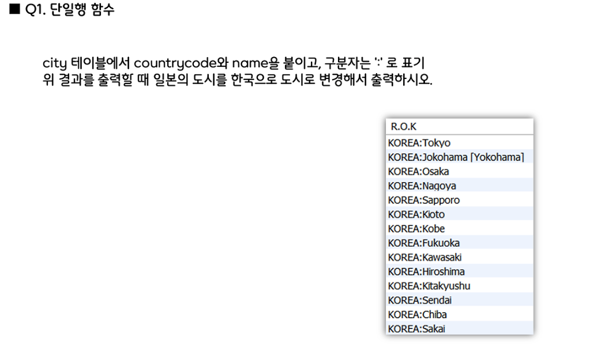

# MySQL 단일행함수

- 단일행 함수



```sql
-- 단일행함수 1번
SELECT concat(replace(CountryCode,'JPN','KOREA'),":", Name) AS 'R.O.K' 
FROM CITY
WHERE CountryCode = 'JPN';
```


```sql
-- 단일행함수 2-1번
SELECT Lpad(Floor(Rand()*1000), 3, '0') AS '난수 3자리';

-- 단일행함수 2-2번
SELECT concat(Countrycode,' : ',District, ' : ',Name) AS "'한미일'에서 인구 Top10 도시명", 
		concat(format(Population, 0),'명') AS '인구'
FROM CITY
WHERE CountryCode in('KOR','USA','JPN')
ORDER BY Population DESC;

-- 단일행함수 2-3번
SELECT city_info,
substring(city_info,1,3) AS "국가코드",
substring_index(city_info,' ',-1) AS "인구" 
FROM t_city;

-- 단일행함수 2-4번
SELECT now() AS "특정날짜",
CASE dayofweek(last_day(now())) 
	WHEN 1 THEN 'Sunday'
    WHEN 2 THEN 'Monday'
    WHEN 3 THEN 'Tuesday'
    WHEN 4 THEN 'Wednesday'
    WHEN 5 THEN 'Thursday'
    WHEN 6 THEN 'Friday'
    WHEN 7 THEN 'Saturday'
END AS "주어진 날짜기준 해당월 마지막일의 요일";
```